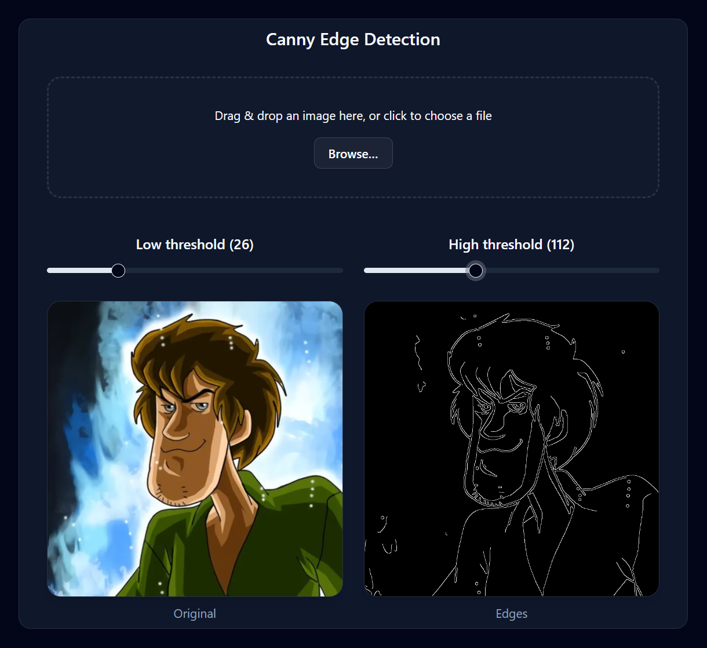

# [Canny Edge Detection SPA](https://ntropish.github.io/edge-detector/)

A lightweight, **pnpm monorepo** that demonstrates real‑time Canny edge detection entirely in the browser using **Rust → WASM** for the heavy lifting and **React + Vite** for the user interface.

<p align="center">
  
</p>

---

## ✨ Features

| Feature                         | Details                                                                                |
| ------------------------------- | -------------------------------------------------------------------------------------- |
| **Pure client‑side processing** | No backend required—Rust code compiled to WebAssembly runs directly in the user’s tab. |
| **Drag‑and‑drop image upload**  | Works with common raster formats (PNG, JPEG, WebP…).                                   |
| **Live threshold sliders**      | Adjust low/high hysteresis thresholds and see edges update instantly.                  |
| **Dark‑mode supported**         | Your system settings will determine if dark mode is enabled or not.                    |

---

## 🗂 Monorepo Structure

```text
packages/
├─ web/              # React + Vite front‑end (TypeScript)
├─ canny-wasm-rust/  # Rust crate compiled to WASM with wasm-pack
└─ canny-wasm/       # Auto‑generated JS + WASM artifacts (DO NOT EDIT)
```

---

## 🔧 Tech Stack

- **pnpm** — Fast, disk‑efficient package manager with workspaces
- **Vite** — Lightning‑fast dev server & bundle for the SPA
- **React 19** — Component model / state management
- **Rust 1.77+** — Performance‑critical Canny implementation
- **wasm‑pack** — Builds the Rust crate to WebAssembly & JS glue
- **TypeScript** — Type safety across web code
- **Shadcn** — A set of beautifully-designed, accessible components and a code distribution platform

---

## 🧩 Scripts Reference

| Scope           | Script        | What it does                                           |
| --------------- | ------------- | ------------------------------------------------------ |
| _root_          | `pnpm build`  | Convenience meta‑script → builds Rust → builds web     |
| canny‑wasm‑rust | `pnpm build`  | `wasm-pack build --target web --out-dir ../canny-wasm` |
| web             | `pnpm dev`    | Run Vite dev server                                    |
| web             | `pnpm build`  | Production bundle (`dist/`)                            |
| web             | `pnpm deploy` | Publish `dist/` to `gh-pages`                          |

---

## 📖 Background

The Canny edge detector (John F. Canny, 1986) is a multi‑stage algorithm that produces a thin, accurate edge map by combining Gaussian blur, Sobel gradients, non‑maximum suppression, and hysteresis. Implementing it in Rust lets us tap into native‑level performance while keeping our UI code in ergonomic TypeScript.

---

## 📄 License

Distributed under the **MIT License**. See `LICENSE` for more information.

---

## 🙏 Acknowledgements

- [wasm‑pack](https://github.com/rustwasm/wasm-pack) — the glue that makes Rust ↔ JS easy
- [Vite](https://vite.dev/) — blazingly fast tooling
- [Canny (1986)](https://ieeexplore.ieee.org/document/4767851) — the original edge detection paper
- Scooby‑Doo™ frame © & ™ Warner Bros. Entertainment Inc. — used here under fair‑use solely for demonstration purposes

---
